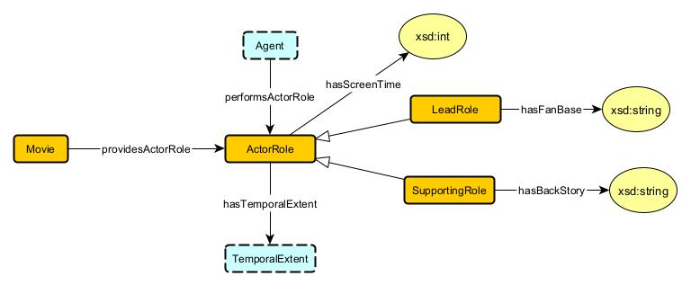
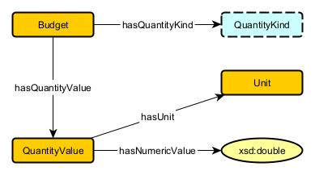
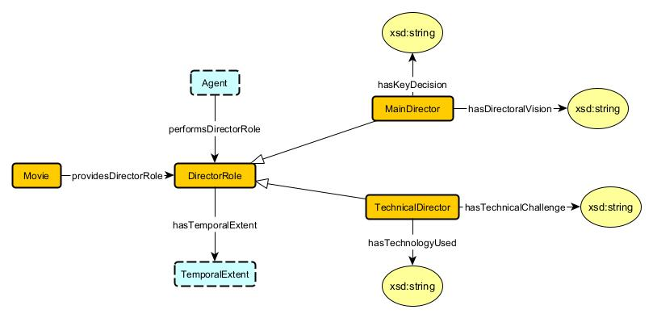
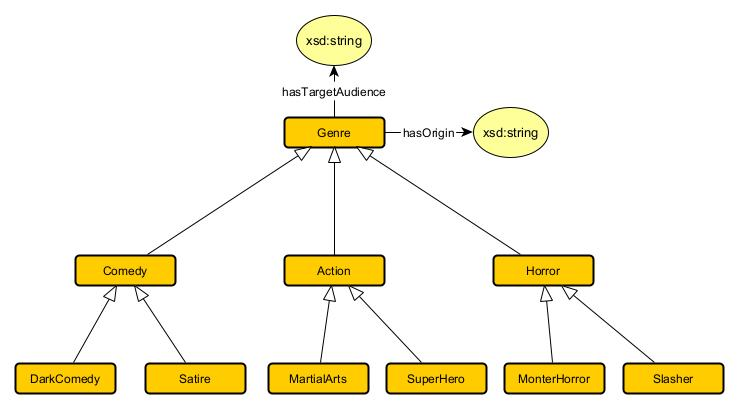

**Actor** 
     

Movie SubClassOf providesActorRole only ActorRole 
The range of the relationship `providesActorRole` must be `ActorRole`.

Movie SubClassOf providesActorRole some ActorRole 
Every `Movie` must provide at least one `ActorRole`.

ActorRole SubClassOf performsActorRole only Agent 
The range of the relationship `performsActorRole` must be `Agent`.

ActorRole SubClassOf performsActorRole some Agent 
Every `ActorRole` must be performed by an `Agent`.

ActorRole SubClassOf hasTemporalExtent only TemporalExtent 
The range of the relationship `hasTemporalExtent` must be `TemporalExtent`.

ActorRole SubClassOf hasTemporalExtent some TemporalExtent 
Every `ActorRole` must have a temporal extent specifying time-related details.

LeadRole SubClassOf hasScreenTime only xsd:int 
The range of the relationship `hasScreenTime` must be `xsd:int`.

LeadRole SubClassOf hasScreenTime some xsd:int 
Every `LeadRole` must have a screen time represented as an integer.

LeadRole SubClassOf hasFanBase only xsd:String 
The range of the relationship `hasFanBase` must be `xsd:String`.

LeadRole SubClassOf hasFanBase some xsd:String 
Every `LeadRole` must have a fan base represented as a string.

SupportingRole SubClassOf hasScreenTime only xsd:int 
The range of the relationship `hasScreenTime` must be `xsd:int`.

SupportingRole SubClassOf hasScreenTime some xsd:int 
Every `SupportingRole` must have a screen time represented as an integer.

SupportingRole SubClassOf hasBackStory only xsd:String 
The range of the relationship `hasBackStory` must be `xsd:String`.

SupportingRole SubClassOf hasBackStory some xsd:String 
Every `SupportingRole` must have a backstory represented as a string.

LeadRole SubClassOf ActorRole 
`LeadRole` is a subclass of `ActorRole`.

SupportingRole SubClassOf ActorRole 
`SupportingRole` is a subclass of `ActorRole`.

LeadRole ⊓ SupportingRole ⊑ ⊥ 
`LeadRole` and `SupportingRole` are disjoint classes, meaning an entity cannot belong to both classes simultaneously.

ActorRole SubClassOf ∀hasTemporalExtent.TemporalExtent 
All objects of the `hasTemporalExtent` relationship for `ActorRole` must be of type `TemporalExtent`

**Budget** 
    

Budget SubClassOf hasQuantityKind only QuantityKind 
The range of the relationship `hasQuantityKind` must be `QuantityKind`.

Budget SubClassOf hasQuantityKind some QuantityKind 
Every `Budget` must be associated with at least one `QuantityKind`.

Budget SubClassOf hasQuantityValue only QuantityValue 
The range of the relationship `hasQuantityValue` must be `QuantityValue`.

Budget SubClassOf hasQuantityValue some QuantityValue 
Every `Budget` must have at least one `QuantityValue`.

QuantityValue SubClassOf hasUnit only Unit 
The range of the relationship `hasUnit` must be `Unit`.

QuantityValue SubClassOf hasUnit some Unit 
Every `QuantityValue` must have a unit associated with it.

QuantityValue SubClassOf hasNumericValue only xsd:double 
The range of the relationship `hasNumericValue` must be `xsd:double`.

QuantityValue SubClassOf hasNumericValue some xsd:double 
Every `QuantityValue` must have a numeric value represented as a double.

QuantityKind ⊓ Unit ⊑ ⊥ 
`QuantityKind` and `Unit` are disjoint classes, meaning an entity cannot belong to both classes simultaneously.

Budget ⊓ QuantityValue ⊑ ⊥ 
`Budget` and `QuantityValue` are disjoint classes, meaning an entity cannot belong to both classes simultaneously.

QuantityValue SubClassOf ∀hasNumericValue.xsd:double 
All objects of the `hasNumericValue` relationship for `QuantityValue` must be of type `xsd:double`.

Budget SubClassOf ⊤ 
`Budget` is a class that exists as a superclass for other relationships

**Country** 
    

ProductionCompany SubClassOf basedIn only Place 
The range of the relationship `basedIn` must be `Place`.

ProductionCompany SubClassOf basedIn some Place 
Every `ProductionCompany` must have a base location represented as a `Place`.

Movie SubClassOf hasFilmingLocation only Place 
The range of the relationship `hasFilmingLocation` must be `Place`.

Movie SubClassOf hasFilmingLocation some Place 
Every `Movie` must have at least one filming location represented by a `Place`.

Place SubClassOf hasCity only City 
The range of the relationship `hasCity` must be `City`.

Place SubClassOf hasCity some City 
Every `Place` must be associated with at least one `City`.

City SubClassOf hasName only xsd:String 
The range of the relationship `hasName` must be `xsd:String`.

City SubClassOf hasName some xsd:String 
Every `City` must have a name represented as a string.

Person SubClassOf isACitizenOf only Country 
The range of the relationship `isACitizenOf` must be `Country`.

Person SubClassOf isACitizenOf some Country 
Every `Person` must be a citizen of at least one `Country`.

Country SubClassOf hasCity only City 
The range of the relationship `hasCity` must be `City`.

Country SubClassOf hasCity some City Every `Country` must have at least one associated `City`.

City SubClassOf Place 
A `City` is a subclass of `Place`.

Country SubClassOf Place 
A `Country` is a subclass of `Place`.

City ⊓ Country ⊑ ⊥ 
`City` and `Country` are disjoint classes, meaning an entity cannot belong to both classes simultaneously. 
ProductionCompany ⊓ Movie ⊑ ⊥ 

`ProductionCompany` and `Movie` are disjoint classes, meaning an entity cannot belong to both classes simultaneously. 
City SubClassOf ∀hasName.xsd:String All objects of the `hasName` relationship for `City` must be of type `xsd:String`. 

City SubClassOf ∀hasName.xsd:String 
All objects of the `hasName` relationship for `City` must be of type `xsd:String`.

**Director** 
    

Movie SubClassOf providesDirectorRole only DirectorRole 
The range of the relationship `providesDirectorRole` must be `DirectorRole`.

Movie SubClassOf providesDirectorRole some DirectorRole 
Every `Movie` must provide at least one `DirectorRole`.

DirectorRole SubClassOf performsDirectorRole only Agent 
The range of the relationship `performsDirectorRole` must be `Agent`.

DirectorRole SubClassOf performsDirectorRole some Agent 
Every `DirectorRole` must be performed by an `Agent`.

DirectorRole SubClassOf hasTemporalExtent only TemporalExtent 
The range of the relationship `hasTemporalExtent` must be `TemporalExtent`.

DirectorRole SubClassOf hasTemporalExtent some TemporalExtent 
Every `DirectorRole` must have a temporal extent specifying its associated time-related details.

MainDirector SubClassOf hasKeyDecision only xsd:String 
The range of the relationship `hasKeyDecision` must be `xsd:String`.

MainDirector SubClassOf hasKeyDecision some xsd:String 
Every `MainDirector` must have key decisions represented as strings.

MainDirector SubClassOf hasDirectorialVision only xsd:String 
The range of the relationship `hasDirectorialVision` must be `xsd:String`.

MainDirector SubClassOf hasDirectorialVision some xsd:String 
Every `MainDirector` must have a directorial vision represented as a string.

TechnicalDirector SubClassOf hasTechnologyUsed only xsd:String 
The range of the relationship `hasTechnologyUsed` must be `xsd:String`.

TechnicalDirector SubClassOf hasTechnologyUsed some xsd:String 
Every `TechnicalDirector` must have technologies used represented as strings.

TechnicalDirector SubClassOf hasTechnicalChallenge only xsd:String 
The range of the relationship `hasTechnicalChallenge` must be `xsd:String`.

TechnicalDirector SubClassOf hasTechnicalChallenge some xsd:String 
Every `TechnicalDirector` must have technical challenges represented as strings.

MainDirector SubClassOf DirectorRole 
A `MainDirector` is a subclass of `DirectorRole`.

TechnicalDirector SubClassOf DirectorRole 
A `TechnicalDirector` is a subclass of `DirectorRole`.

MainDirector ⊓ TechnicalDirector ⊑ ⊥ 
`MainDirector` and `TechnicalDirector` are disjoint classes, meaning an entity cannot belong to both classes simultaneously.

**Genre** 
 

Genre SubClassOf hasTargetAudience only xsd:String 
The range of the relationship `hasTargetAudience` must be `xsd:String`.

Genre SubClassOf hasTargetAudience some xsd:String 
Every `Genre` must have a target audience represented as a string.

Genre SubClassOf hasOrigin only xsd:String 
The range of the relationship `hasOrigin` must be `xsd:String`.

Genre SubClassOf hasOrigin some xsd:String 
Every `Genre` must have an origin represented as a string.

Comedy SubClassOf Genre 
A `Comedy` is a subclass of `Genre`.

Action SubClassOf Genre 
An `Action` is a subclass of `Genre`.

Horror SubClassOf Genre 
A `Horror` is a subclass of `Genre`.

DarkComedy SubClassOf Comedy 
`DarkComedy` is a subclass of `Comedy`.

Satire SubClassOf Comedy 
`Satire` is a subclass of `Comedy`.

MartialArts SubClassOf Action 
`MartialArts` is a subclass of `Action`.

Superhero SubClassOf Action 
`Superhero` is a subclass of `Action`.

MonsterHorror SubClassOf Horror 
`MonsterHorror` is a subclass of `Horror`.

Slasher SubClassOf Horror 
`Slasher` is a subclass of `Horror`.

Comedy ⊓ Action ⊑ ⊥ 
`Comedy` and `Action` are disjoint classes, meaning an entity cannot belong to both classes simultaneously.

Comedy ⊓ Horror ⊑ ⊥ 
`Comedy` and `Horror` are disjoint classes.

Action ⊓ Horror ⊑ ⊥ 
`Action` and `Horror` are disjoint classes.

DarkComedy ⊓ Satire ⊑ ⊥ 
`DarkComedy` and `Satire` are disjoint subclasses of `Comedy`.

MartialArts ⊓ Superhero ⊑ ⊥ 
`MartialArts` and `Superhero` are disjoint subclasses of `Action`.

MonsterHorror ⊓ Slasher ⊑ ⊥ 
`MonsterHorror` and `Slasher` are disjoint subclasses of `Horror`.

Genre SubClassOf ≤1hasTargetAudience 
Each `Genre` can have at most one `hasTargetAudience` relationship.

Genre SubClassOf ≤1hasOrigin 
Each `Genre` can have at most one `hasOrigin` relationship.

Comedy SubClassOf hasTargetAudience some xsd:String 
Every `Comedy` genre must have a target audience.

Action SubClassOf hasOrigin some xsd:String 
Every `Action` genre must have an origin.

Horror SubClassOf hasTargetAudience some xsd:String 
Every `Horror` genre must have a target audience.

**GrossEarning** 
    

GrossEarnings SubClassOf hasEarningsValue only EarningsValue 
The range of the relationship `hasEarningsValue` must be `EarningsValue`.

GrossEarnings SubClassOf hasEarningsValue some EarningsValue 
Every `GrossEarnings` must have at least one associated `EarningsValue`.

GrossEarnings SubClassOf hasEarningsType only EarningsType 
The range of the relationship `hasEarningsType` must be `EarningsType`.

GrossEarnings SubClassOf hasEarningsType some EarningsType 
Every `GrossEarnings` must have an associated `EarningsType`.

EarningsValue SubClassOf hasNumericValue only xsd:int 
The range of the relationship `hasNumericValue` must be `xsd:int`.

EarningsValue SubClassOf hasNumericValue some xsd:int 
Every `EarningsValue` must have a numeric value represented as an integer.

EarningsValue SubClassOf hasCurrency only Currency 
The range of the relationship `hasCurrency` must be `Currency`.

EarningsValue SubClassOf hasCurrency some Currency 
Every `EarningsValue` must have an associated `Currency`.

**MovieRating** 
    

MovieRatingObservation SubClassOf observedProperty only Rating 
The range of the relationship `observedProperty` must be `Rating`.

MovieRatingObservation SubClassOf observedProperty some Rating 
Every `MovieRatingObservation` must observe at least one `Rating`.

MovieRatingObservation SubClassOf hasSimpleResult only rdfs:NumericUserRatingValue 
The range of the relationship `hasSimpleResult` must be `rdfs:NumericUserRatingValue`.

MovieRatingObservation SubClassOf hasSimpleResult some rdfs:NumericUserRatingValue 
Every `MovieRatingObservation` must have a simple result represented as a numeric user rating value.

MovieRatingObservation SubClassOf hasPhenomenonTime only RatingDate 
The range of the relationship `hasPhenomenonTime` must be `RatingDate`.

MovieRatingObservation SubClassOf hasResultTime only RatingDate 
The range of the relationship `hasResultTime` must be `RatingDate`.

MovieRatingObservation SubClassOf hasPhenomenonTime some RatingDate and hasResultTime some RatingDate 
Every `MovieRatingObservation` must have a phenomenon time and a result time represented as a `RatingDate`.

⊤ SubClassOf ≤1hasPhenomenonTime 
Each `MovieRatingObservation` can have at most one `hasPhenomenonTime` relationship.

MovieRatingObservation SubClassOf hasResult only RatingValue 
The range of the relationship `hasResult` must be `RatingValue`.

MovieRatingObservation SubClassOf hasResult some RatingValue 
Every `MovieRatingObservation` must have a result represented by a `RatingValue`.

MovieRatingObservation SubClassOf hasObservedMovie only Movie 
The range of the relationship `hasObservedMovie` must be `Movie`.

MovieRatingObservation SubClassOf hasObservedMovie some Movie 
Every `MovieRatingObservation` must be associated with at least one observed `Movie`.

Platform SubClassOf hasAPlatformName only xsd:String 
The range of the relationship `hasAPlatformName` must be `xsd:String`.

Platform SubClassOf hasAPlatformName some xsd:String 
Every `Platform` must have a name represented as a string.

**ProducationCompany** 
    

Movie SubClassOf providesProductionRole only ProductionRole 
The range of the relationship `providesProductionRole` must be `ProductionRole`.

Movie SubClassOf providesProductionRole some ProductionRole 
Every `Movie` must provide at least one `ProductionRole`.

ProductionRole SubClassOf hasTemporalExtent only ProductionPeriod 
The range of the relationship `hasTemporalExtent` must be `ProductionPeriod`.

ProductionRole SubClassOf hasTemporalExtent some ProductionPeriod 
Every `ProductionRole` must have a temporal extent specifying its associated `ProductionPeriod`.

ProductionRole SubClassOf performedBy only Agent 
The range of the relationship `performedBy` must be `Agent`.

ProductionRole SubClassOf performedBy some Agent 
Every `ProductionRole` must be performed by an `Agent`.

ExecutiveProducer SubClassOf hasFinancialContribution only xsd:int 
The range of the relationship `hasFinancialContribution` must be `xsd:int`.

ExecutiveProducer SubClassOf hasFinancialContribution some xsd:int 
Every `ExecutiveProducer` must have a financial contribution represented as an integer.

ExecutiveProducer SubClassOf hasCreativeControl only xsd:String 
The range of the relationship `hasCreativeControl` must be `xsd:String`.

ExecutiveProducer SubClassOf hasCreativeControl some xsd:String 
Every `ExecutiveProducer` must have creative control represented as a string.

ExecutiveProducer SubClassOf hasContractTerms only xsd:int 
The range of the relationship `hasContractTerms` must be `xsd:int`.

ExecutiveProducer SubClassOf hasContractTerms some xsd:int 
Every `ExecutiveProducer` must have contract terms represented as an integer.

Distribution SubClassOf hasRevenueSharePercentage only xsd:int 
The range of the relationship `hasRevenueSharePercentage` must be `xsd:int`.

Distribution SubClassOf hasRevenueSharePercentage some xsd:int 
Every `Distribution` must have a revenue share percentage represented as an integer.

Distribution SubClassOf hasDistributionRegion only xsd:String 
The range of the relationship `hasDistributionRegion` must be `xsd:String`.

Distribution SubClassOf hasDistributionRegion some xsd:String 
Every `Distribution` must have a distribution region represented as a string.

Distribution SubClassOf hasReleasePlatforms only xsd:String 
The range of the relationship `hasReleasePlatforms` must be `xsd:String`.

Distribution SubClassOf hasReleasePlatforms some xsd:String 
Every `Distribution` must have release platforms represented as a string.

**InflationRate** 
    

InflationObservation SubClassOf contains only InflationTimeExtent 
The range of the relationship `contains` must be `InflationTimeExtent`.

InflationObservation SubClassOf contains some InflationTimeExtent 
Every `InflationObservation` must contain at least one `InflationTimeExtent`.

InflationTimeExtent SubClassOf hasDuration only ObservationPeriod 
The range of the relationship `hasDuration` must be `ObservationPeriod`.

InflationTimeExtent SubClassOf hasDuration some ObservationPeriod 
Every `InflationTimeExtent` must have a duration represented by an `ObservationPeriod`.

ObservationPeriod SubClassOf startsFrom only ReleaseDate 
The range of the relationship `startsFrom` must be `ReleaseDate`.

ObservationPeriod SubClassOf endsAt only ReleaseDate 
The range of the relationship `endsAt` must be `ReleaseDate`.

ObservationPeriod SubClassOf startsFrom some ReleaseDate and endsAt some ReleaseDate 
Every `ObservationPeriod` must have a starting and an ending point represented by `ReleaseDate`.

InflationTimeExtent SubClassOf hasValue only InflationRateValue 
The range of the relationship `hasValue` must be `InflationRateValue`.

InflationTimeExtent SubClassOf hasValue some InflationRateValue 
Every `InflationTimeExtent` must have a value represented by an `InflationRateValue`.

InflationRateValue SubClassOf hasPercentage only xsd:double 
The range of the relationship `hasPercentage` must be `xsd:double`.

InflationRateValue SubClassOf hasPercentage some xsd:double 
Every `InflationRateValue` must have a percentage represented as a double.

ReleaseDate SubClassOf hasReferenceSystem only CurrencyReferenceSystem 
The range of the relationship `hasReferenceSystem` must be `CurrencyReferenceSystem`.

ReleaseDate SubClassOf hasReferenceSystem some CurrencyReferenceSystem 
Every `ReleaseDate` must have a reference system associated with a `CurrencyReferenceSystem`.

**UserRating** 
    

UserRatingObservation SubClassOf observedProperty only RatingType 
The range of the relationship `observedProperty` must be `RatingType`.

UserRatingObservation SubClassOf observedProperty some RatingType 
Every `UserRatingObservation` must observe at least one `RatingType`.

UserRatingObservation SubClassOf hasSimpleResult only rdfs:NumericRatingValue 
The range of the relationship `hasSimpleResult` must be `rdfs:NumericRatingValue`.

UserRatingObservation SubClassOf hasSimpleResult some rdfs:NumericRatingValue 
Every `UserRatingObservation` must have a simple result as a numeric rating value.

UserRatingObservation SubClassOf hasResultTime only RatingDate 
The range of the relationship `hasResultTime` must be `RatingDate`.

UserRatingObservation SubClassOf hasResultTime some RatingDate 
Every `UserRatingObservation` must have a result time as a `RatingDate`.

UserRatingObservation SubClassOf hasResultTime max 1 RatingDate 
Each `UserRatingObservation` can have at most one `hasResultTime` relationship.

UserRatingObservation SubClassOf hasResult only RatingValue 
The range of the relationship `hasResult` must be `RatingValue`.

UserRatingObservation SubClassOf hasResult some RatingValue 
Every `UserRatingObservation` must have a result represented by a `RatingValue`.

UserRatingObservation SubClassOf hasObservedMovie only Movie 
The range of the relationship `hasObservedMovie` must be `Movie`.

UserRatingObservation SubClassOf hasObservedMovie some Movie 
Every `UserRatingObservation` must observe at least one `Movie`.

Platform SubClassOf hasAPlatformName only xsd:String 
The range of the relationship `hasAPlatformName` must be `xsd:String`.

Platform SubClassOf hasAPlatformName some xsd:String 
Every `Platform` must have a platform name represented as a string.

RatingType SubClassOf hasADescription only xsd:String 
The range of the relationship `hasADescription` must be `xsd:String`.

RatingType SubClassOf hasADescription some xsd:String 
Every `RatingType` must have a description represented as a string.

RatingType SubClassOf hasMaxScale only xsd:int 
The range of the relationship `hasMaxScale` must be `xsd:int`.

RatingType SubClassOf hasMaxScale some xsd:int 
Every `RatingType` must have a maximum scale represented as an integer.

**Vote** 
    

`VoteObservation SubClassOf observedProperty only VoteType` 
The range of the relationship `observedProperty` must be `VoteType`. 

`VoteObservation SubClassOf observedProperty some VoteType` 
Every `VoteObservation` must observe at least one `VoteType`. 

`VoteObservation SubClassOf hasSimpleResult only rdfs:NumericVoteValue` 
The range of the relationship `hasSimpleResult` must be `rdfs:NumericVoteValue`. 

`VoteObservation SubClassOf hasSimpleResult some rdfs:NumericVoteValue` 
Every `VoteObservation` must have a simple result. 

`VoteObservation SubClassOf hasPhenomenonTime only VoteDate` 
The range of the relationship `hasPhenomenonTime` must be `VoteDate`. 

`VoteObservation SubClassOf hasPhenomenonTime some VoteDate` 
Every `VoteObservation` must have a phenomenon time. 

`VoteObservation SubClassOf hasPhenomenonTime max 1 VoteDate` 
Each `VoteObservation` can have at most one phenomenon time. 

`VoteObservation SubClassOf hasResult only VoteCount` 
The range of the relationship `hasResult` must be `VoteCount`. 

`VoteObservation SubClassOf hasResult some VoteCount` 
Every `VoteObservation` must have a result. 

`VoteObservation SubClassOf hasFeatureOfInterest only Movie` 
The range of the relationship `hasFeatureOfInterest` must be `Movie`. 

`VoteObservation SubClassOf hasFeatureOfInterest some Movie` 
Every `VoteObservation` must have a feature of interest. 

`Platform SubClassOf hasAPlatformName only xsd:String` 
The range of the relationship `hasAPlatformName` must be `xsd:String`. 

`Platform SubClassOf hasAPlatformName some xsd:String` 
Every `Platform` must have a platform name. 

`VoteType SubClassOf hasADescription only xsd:String` 
 
The range of the relationship `hasADescription` must be `xsd:String`. 

`VoteType SubClassOf hasADescription some xsd:String` 
Every `VoteType` must have a description. 

`VoteType SubClassOf hasAScale only xsd:int` 
The range of the relationship `hasAScale` must be `xsd:int`. 

`VoteType SubClassOf hasAScale some xsd:int` 
Every `VoteType` must have a scale. 

